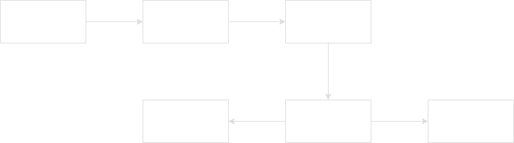
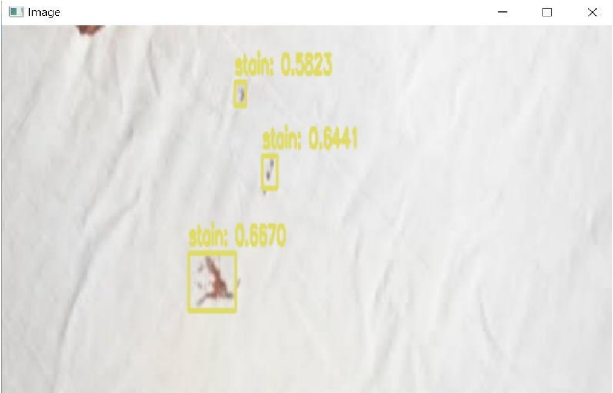
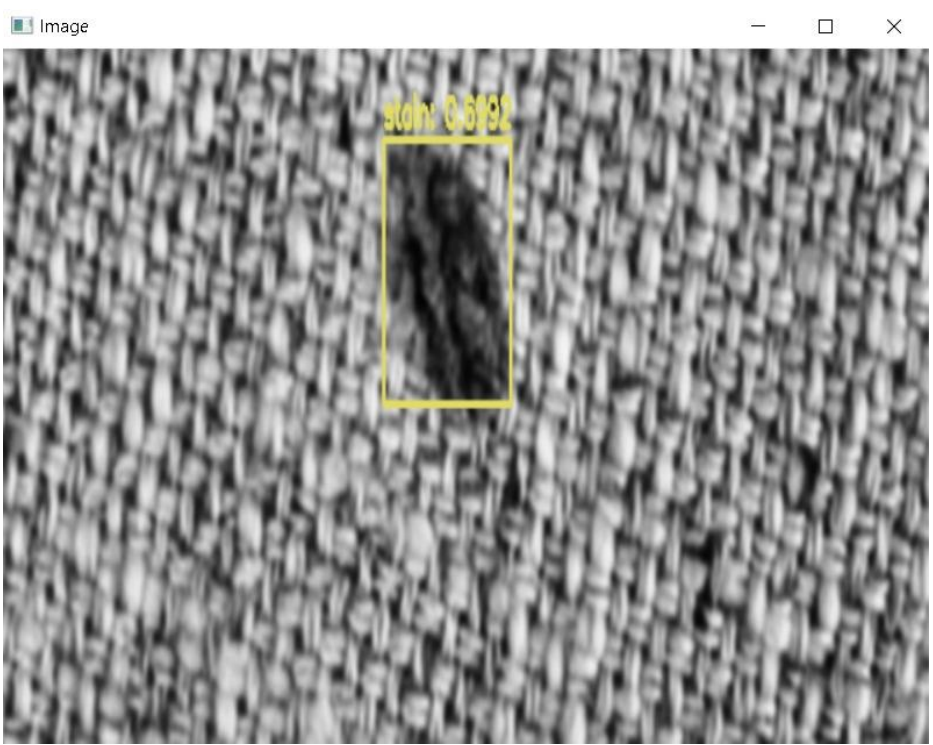

<h2 align="left">Title🧐</h2>

###

<h4 align="center">AUTOMATIC TEXTILE STAIN DETECTION FOR MANUFACTURING FACILITY BASED ON IMPROVED YOLO ALGORITHM</h4>

###

<h2 align="left">Introduction📖</h2>

###

Computer vision and image classification-based models are used in various applied domains including industry-based problems.
Clothing is considered as one of the basic requirements for human life, and the history of the textile industry is as old as human civilization.
  Traditionally, the inspection process is completed by using manual human efforts to ensure the quality of fabric. 
The price of fabric that is sent to the market depends on the number of co-occurrence of defects and price increase with the increase in the number of defects. 
As a defect is detected, the production process is stopped and the details about the occurred defect are recorded with its location by the machine operator. 
 Main drawbacks associated during manual inspections are as follows:
<ol>
<li> Training of individuals is required to make them fabric inspector.</li>
<li> Major defects can be detected while small defects can be ignored due to human carelessness.</li>
<li> Lot of human effort is required to locate fabric defects.</li>
<li> It is very difficult for fabric inspectors to keep focus on the production process for a time that is more than 10 minutes and all of this can lead to a low efficiency of production.</li>
</ol>

###

<h2 align="left">Objective🔭</h2>

###

The main objective of this project is to design and develop low-cost fabric stain detection using yolo object detection algorithm at the industrial level.

###

<h2 align="left">System Design💻</h2>

###

###

<h2 align="left">Language used🌀</h2>

###

  
 
Python is a popular programming language. It was created by Guido van Rossum, and released in 1991.

###

<h2 align="left">Algorithm📐</h2>

###

We have used YOLO algorithm 
<a href="https://pjreddie.com/darknet/yolo/">Click here to get more information about the algoritm</a>

###

  

###

<h2 align="left">Output📤</h2>

###

  
